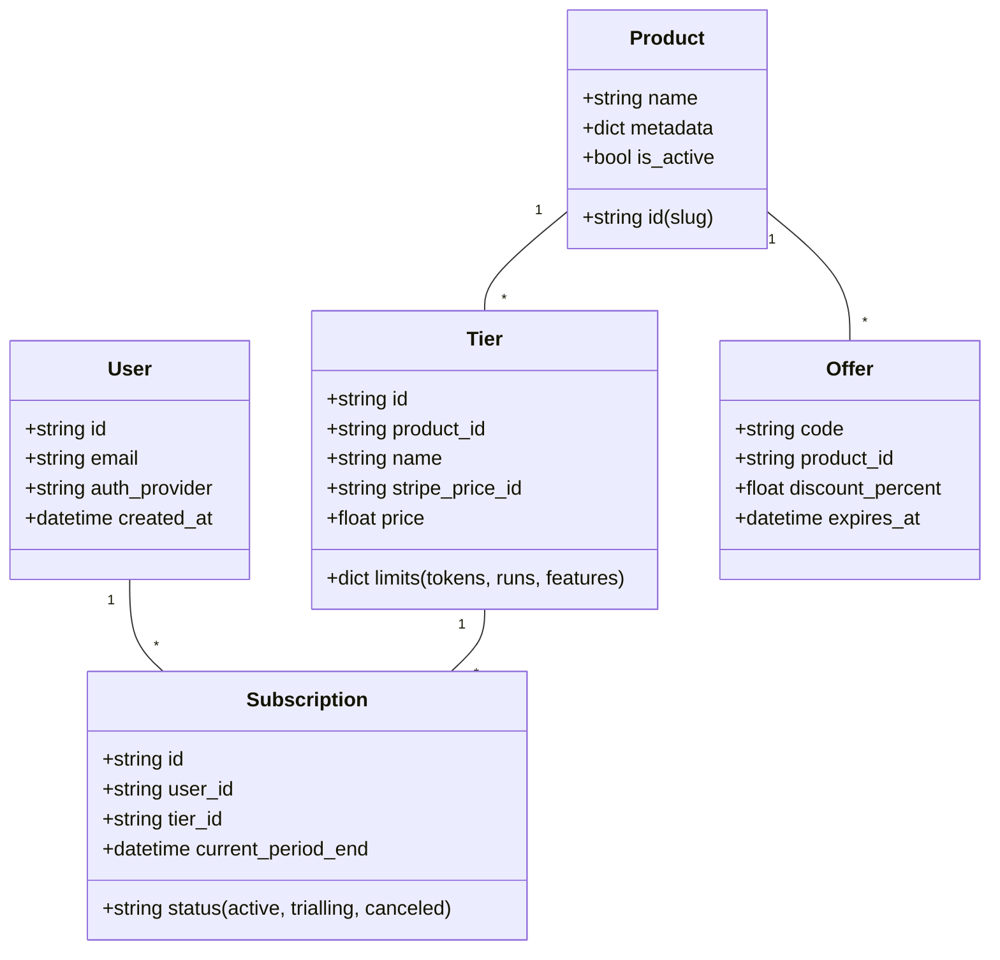

# 🌐 CENF Universal License & Payment System (ULPS) v1.0

Este documento define la arquitectura maestra para el sistema centralizado de gestión de licencias y pagos de CENF. El objetivo es crear un "SaaS-as-a-Service" interno que pueda ser consumido por cualquier producto agéntico de la suite.

---

## 🏛️ Arquitectura de Clase (Abstracción)

El sistema se basa en un modelo **Multi-Product Tenancy**.

### 1. Modelo de Datos (Esquema Granular)



---

## 🏗️ Implementación Técnica (Clases Core)

Para garantizar la portabilidad, el backend se estructurará en clases abstractas.

### `LPSManager` (Universal Manager)
Responsable de orquestar la relación entre identidad, producto y pago.

```python
class ULPSManager:
    def __init__(self, db_provider, payment_provider):
        self.db = db_provider
        self.payment = payment_provider # Stripe

    def validate_access(self, email, product_id):
        """Valida si el usuario tiene una suscripción activa para un producto."""
        user = self.db.get_user(email)
        subscription = self.db.get_active_subscription(user.id, product_id)
        return subscription.is_valid() if subscription else False

    def get_product_config(self, product_id):
        """Retorna la configuración granular (límites/features) del producto."""
        return self.db.get_product_settings(product_id)
```

---

## 💰 Gestión de Pagos (Stripe Engine)

### Abstracción de Pagos
Usaremos **Stripe Checkout** para máxima seguridad y cumplimiento (GDPR/EU/LatAm).

- **Webhook Handler:** Una clase dedicada a procesar eventos de Stripe (`invoice.paid`, `customer.subscription.deleted`).
- **Currencies:** Soporte multi-moneda (USD para global, ARS via intermediarios si fuera necesario).
- **GDPR Compliance:** Rutinas automáticas de borrado (`anonymize_user`) y exportación de datos.

---

## 🛠️ Configurabilidad y Escalabilidad

El sistema es **Granular y Portable** porque:
1. **Nuevos Productos:** Solo se añade una fila en la tabla `Products` y sus respectivos `Tiers`. No requiere cambios de código.
2. **Nuevas Ofertas:** Se gestionan mediante metadatos en el objeto `Offer`.
3. **Multi-Plataforma:** La API REST (en GCR) puede ser consumida por apps desktop (Audio2Text), web (CenfCloud) o bots de Telegram.

---
**Diseño:** Antigravity (CENF OS)  
**Fecha:** 2025-12-27
