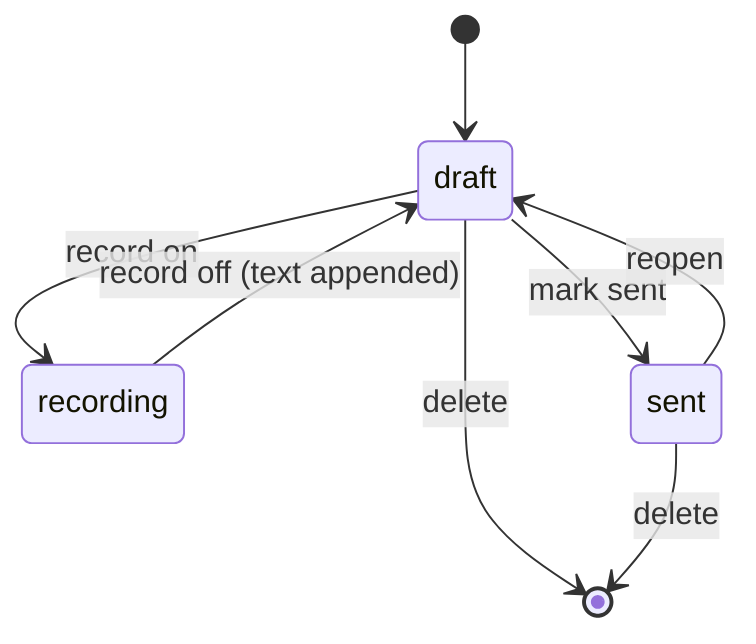

# F2 Supervisor — Specification

## Requirement: Entry model

Each entry SHALL contain: `number` (int, sequential), `quote` (AI excerpt, may be
empty), `response` (user correction, may contain inserted context-block text),
`blocks` (list of block ids inserted), `status` ("draft" | "sent"), `created_at`,
`updated_at` (ISO-8601). Entries SHALL be ordered by number.

### Scenario: New entry
- WHEN the user presses "Nueva respuesta"
- THEN a new entry with the next sequential number is appended, status "draft",
  and the workbench focuses its response field

## Requirement: Persistence with autosave

The store SHALL persist all entries to a single JSON file (config key
`supervisor_data_path`, default `supervisor_entries.json` at repo root). Every
mutation (create/update/delete/status) SHALL write the file immediately (atomic
write: temp + replace). The UI SHALL debounce keystroke updates (>= 500 ms). A
corrupt file SHALL NOT crash the app: the store starts empty, backs up the corrupt
file as `<name>.corrupt-<timestamp>`, and logs an error.

### Scenario: Crash safety
- WHEN the app is killed at any moment
- THEN the JSON on disk contains every acknowledged change (no buffer loss)

## Requirement: Context blocks

The system SHALL load `*.md` files from the configured directory (config key
`context_blocks_dir`) parsing YAML frontmatter (id, name, description) and body.
A selectbox SHALL list them by name (id fallback); selecting "insert" SHALL insert
the body at the cursor position of the current entry's response field. A missing or
unreadable directory SHALL degrade to an empty list with one logged warning.

### Scenario: Insert block
- WHEN the user picks a block and presses insert
- THEN the block body is appended at the cursor of the current response and the
  block id is recorded in the entry's `blocks` list (no duplicate ids)

## Requirement: Assembled copy

"Copiar respuesta N" SHALL copy that entry assembled as:
`N. "<quote>"\n: <response>` (quote omitted when empty). "Copiar todo" SHALL copy
all entries in order, separated by a blank line. Copies go to the clipboard
(pyperclip) and are confirmed via status message.

### Scenario: Copy all
- WHEN the user presses "Copiar todo"
- THEN the clipboard contains every entry assembled in numeric order

## Requirement: CRUD + status

The user SHALL be able to edit any entry (quote and response), delete any entry
(confirm dialog; remaining entries keep their numbers — numbers are historical),
and toggle status borrador/enviada. Deleting SHALL update the store immediately.

## Requirement: Voice recording per fragment

Each entry SHALL have a record toggle: starting it SHALL capture microphone audio
to a temp WAV (16 kHz mono); stopping it SHALL transcribe the WAV via the existing
`Transcriber.transcribe_with_groq` and append the text to that entry's response.
Recording SHALL be refused (status message, logged) if the main Transcriber is
already recording. Only ONE supervisor recording at a time.

### Scenario: Record a correction
- GIVEN the main recorder is idle
- WHEN the user toggles record on entry N and speaks, then toggles off
- THEN the transcribed text is appended to entry N's response and persisted

## Requirement: State machine (ARCH-009)

Entry lifecycle: `draft -> sent -> draft (reopen allowed)`. Recording is a sub-state
of draft (`draft/recording`). Illegal transitions are no-ops with a logged warning.

## Requirement: Internationalization + constraints

All user-visible strings SHALL be i18n keys present in lang/es.json and lang/en.json.
Pure modules ≤400 lines, typed, Google docstrings, no secrets, tests FIRST.
