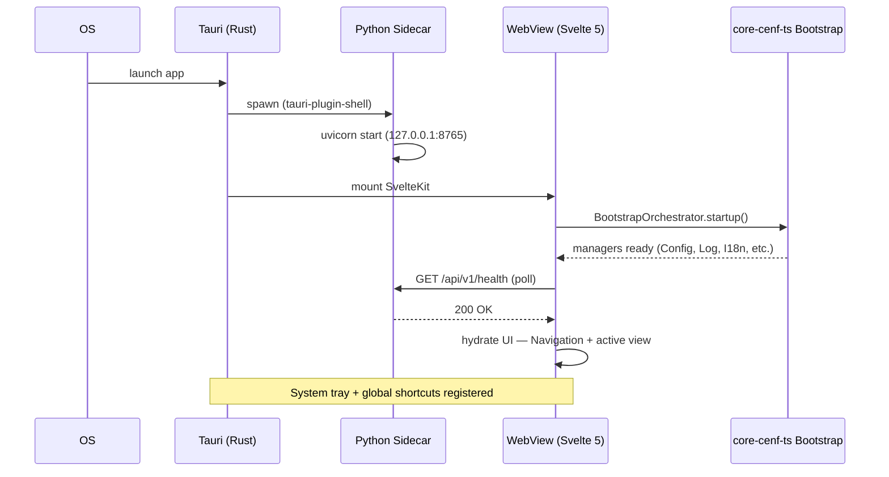
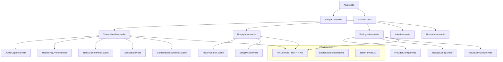
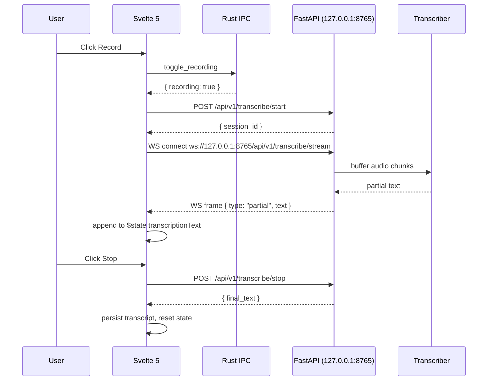

# Design: Audio2Text — Tauri v2 UI Migration (v0.16.0)

## Technical Approach

Replace the Flet presentation layer with Tauri v2 + Svelte 5 while keeping the FastAPI backend untouched. Backend (Python sidecar) is spawned by Rust on startup, killed on shutdown. Frontend communicates via HTTP + WebSocket directly to `127.0.0.1:8765`. The Rust layer is minimal (~250 lines): IPC commands, system tray, global shortcuts. Svelte 5 uses Runes (`$state`, `$derived`, `$effect`) with BootstrapOrchestrator from core-cenf-ts (v0.2.0, local install). Dark Goldenrod design tokens drive shadcn-svelte via Tailwind v4 `@theme`.

## Architecture Decisions

| # | Decision | Options | Choice | Rationale |
|---|---|---|---|---|
| D1 | Backend lifecycle | (a) Tauri sidecar (b) manual launcher (c) Windows service | (a) Tauri sidecar | Spec REQ: auto-start on app launch, SIGTERM on quit. Rust manages PID, status IPC |
| D2 | Monorepo structure | (a) single pkg (b) pnpm workspace + `audio2text/` | (b) pnpm workspace | CES standard; Turborepo for parallel builds. `audio2text/` = backend, new `src/` + `src-tauri/` = Tauri frontend |
| D3 | State management | (a) Svelte stores (b) `$state` Runes + context (c) Zustand | (b) `$state` Runes | CES: Convention over Configuration. Svelte 5 idiomatic, zero deps |
| D4 | WS reconnection | (a) manual (b) exp backoff (c) Tauri plugin | (b) exponential backoff | Spec REQ: 1 auto-reconnect. Lightweight, no plugin dependency |
| D5 | core-cenf-ts wiring | (a) BootstrapOrchestrator full (b) manual (c) Config only | (a) BootstrapOrchestrator | Spec REQ: Config, Log, I18n, Cache, Health, HttpClient, Secret, Validation wired. Full bootstrap is 1 call |
| D6 | Design token source | (a) tokens.json → generator (b) CSS vars only (c) Tailwind config | (a) tokens.json → tokens.css + `@theme` | Spec REQ: single source of truth (tokens.json), generates CSS vars, maps to Tailwind utilities |
| D7 | Hotkey impl | (a) Tauri global-shortcut plugin (b) Python keyboard lib | (a) Tauri plugin | Spec REQ: `Ctrl+Shift+R` default, native, no Python dependency for hotkeys |
| D8 | API client | (a) TypeScript class (b) OpenAPI gen (c) Tauri IPC proxy | (a) TypeScript + Zod | Spec REQ: typed HTTP + WS. Direct from webview — no Rust middleman per user decision |
| D9 | Component library | (a) shadcn-svelte (b) custom (c) Flowbite | (a) shadcn-svelte | CES mandated. bits-ui + lucide-svelte. Dark Goldenrod via CSS var inheritance |
| D10 | Delivery strategy | (a) single PR (b) Feature Branch Chain (c) stacked PRs | (b) Feature Branch Chain | ~1500+ lines total across 4 slices. Feature must integrate before `main`. PR1 targets tracker branch |

## Bootstrap Wiring (Mermaid)

## Component Map

## Chained PR Slice Plan (Feature Branch Chain)

Tracker branch: `feature/audio2text-v0.16.0-tauri-migration` (draft PR, no-merge until chain complete).

| Slice | PR Title | Scope | Est. Lines | Base |
|---|---|---|---|---|
| 1 | `feat(tauri): Tauri shell + SvelteKit + design tokens + core-cenf-ts` | CTA scaffold, Rust sidecar, tokens.json/tokens.css, Tailwind @theme, BootstrapOrchestrator, Navigation shell, App shell, `pnpm-workspace.yaml` | ~350 | `feat/audio2text-v0.16.0-tauri-migration` |
| 2 | `feat(ui): TranscribeView + WS streaming + recording overlay + API client` | APIClient (HTTP+WS), TranscribeView, AudioCapture, RecordingOverlay, TranscriptionPanel, StatusBar, ContextBlocksSelector, hotkey store, WS reconnect | ~380 | PR #1 |
| 3 | `feat(ui): Settings + History + Info + Update views` | SettingsView (8 panels), HistoryView (search+emoji), InfoView, UpdateView, emoji picker | ~400 | PR #2 |
| 4 | `feat(cleanup): Polish + Playwright E2E + CI/CD + delete Flet UI` | Playwright tests, CI workflow (tauri-action), `audio2text/ui/` deletion, `audio2text/main.py` simplification, docs update | ~350 | PR #3 |

## Data Flow (Transcription)

## File Changes

| File | Action | Description |
|---|---|---|
| `src-tauri/Cargo.toml` | Create | Tauri v2, serde, serde_json, tauri-plugin-shell, global-shortcut |
| `src-tauri/tauri.conf.json` | Create | Window 1100x760, id `com.cenf.audio2text`, sidecar config |
| `src-tauri/capabilities/default.json` | Create | Minimal permissions: core, shell, global-shortcut, window |
| `src-tauri/src/lib.rs` | Create | Commands: toggle_recording, get_hotkeys, set_hotkey, start_backend, stop_backend, get_backend_status, show_tray. ~250 lines |
| `src-tauri/icons/` | Create | App icons (png/ico) |
| `src/design-tokens/tokens.json` | Create | 50 design tokens (colors, typography, spacing, shadows) |
| `src/design-tokens/tokens.css` | Create | 50 `--dt-*` CSS custom properties generated from tokens.json |
| `src/app.css` | Create | Import tokens.css, Tailwind v4 @theme directive, shadcn var overrides |
| `src/app.svelte` | Create | Root component — Navigation + Content routing |
| `src/lib/infrastructure/bootstrap.ts` | Create | core-cenf-ts BootstrapOrchestrator startup |
| `src/lib/infrastructure/api-client.ts` | Create | Typed APIClient (16 endpoints + WS), Zod schemas |
| `src/lib/infrastructure/ws-reconnect.ts` | Create | WebSocket exponential backoff helper |
| `src/lib/state/transcription.svelte.ts` | Create | `$state` rune for transcription text, recording status |
| `src/lib/state/navigation.svelte.ts` | Create | `$state` rune for current view |
| `src/lib/state/hotkey.svelte.ts` | Create | Hotkey registration + event listener |
| `src/lib/state/settings.svelte.ts` | Create | Settings state with debounced PUT |
| `src/lib/components/Navigation.svelte` | Create | Sidebar: 5 tabs, lucide icons |
| `src/lib/components/AudioCapture.svelte` | Create | Record button (shadcn Button) |
| `src/lib/components/RecordingOverlay.svelte` | Create | LED + MM:SS timer |
| `src/lib/components/TranscriptionPanel.svelte` | Create | Live scrolling text area |
| `src/lib/components/StatusBar.svelte` | Create | Provider, model, connection status |
| `src/lib/components/ContextBlocksSelector.svelte` | Create | Toggle blocks (task extractor, summary, keywords) |
| `src/lib/components/ProviderConfig.svelte` | Create | API keys (password), model dropdown, faster-whisper config |
| `src/lib/components/HotkeyConfig.svelte` | Create | Hotkey rebinding UI |
| `src/lib/components/VocabularyEditor.svelte` | Create | Custom corrections editor |
| `src/lib/components/HistorySearch.svelte` | Create | Searchable history list |
| `src/lib/components/EmojiPicker.svelte` | Create | Emoji selector for history items |
| `src/routes/+layout.svelte` | Create | SvelteKit layout — App shell |
| `src/routes/+page.svelte` | Create | Single-page entry (no SSR) |
| `static/` | Create | Static assets |
| `package.json` (root) | Create | pnpm workspace root |
| `pnpm-workspace.yaml` | Create | `packages: ['src', 'src-tauri']` |
| `turbo.json` | Create | Turborepo pipeline config |
| `svelte.config.js` | Create | SvelteKit adapter-static for Tauri |
| `vite.config.ts` | Create | Vite config, Tailwind plugin |
| `tailwind.config.ts` | Create | Tailwind v4 config with @theme |
| `tsconfig.json` | Create | TypeScript config |
| `components.json` | Create | shadcn-svelte config |
| `.github/workflows/tauri-ci.yml` | Create | tauri-action build + Playwright |
| `audio2text/main.py` | Modify | Remove Flet import, keep only sidecar-compatible entry point |
| `audio2text/ui/` | Delete | Entire Flet UI layer (app.py, views/, components/, state/, client/, theme/) |

**Total: ~40 new files, 1 modified, ~15 deleted. ~1500 lines estimated.**

## Testing Strategy

| Layer | What to Test | Approach |
|---|---|---|
| Unit (Vitest) | APIClient HTTP/WS, Zod schemas, WS reconnect, state runes, core-cenf-ts bootstrap | Mock fetch/WebSocket. `vitest` |
| Component (Vitest + svelte-testing) | Navigation, AudioCapture, RecordingOverlay, TranscriptionPanel, ProviderConfig, EmojiPicker | Mount each component, assert renders with Dark Goldenrod tokens |
| Integration (Vitest) | Navigation → view switching `$state`, Settings → debounced PUT, TranscribeView → WS lifecycle | Mock APIClient, assert state transitions |
| E2E (Playwright) | Full transcription flow, hotkey trigger, settings save, history search+emoji, update check, system tray quit | Tauri binary via `@playwright/test` + tauri-action. Windows runner |
| Rust (cargo test) | Backend start/stop, get_backend_status, get_hotkeys IPC commands | Unit test Rust commands with mocked sidecar |

**Coverage targets**: Unit 90%+, E2E all critical paths.

## Threat Matrix

N/A — `references/threat-matrix.md` not found in project. Sidecar execution is handled by `tauri-plugin-shell` which enforces capability permissions. No custom shell command construction. No VCS/PR automation in this change.

## Migration / Rollout

1. Slice 1 (shell) — scaffold exists; project fails to build until Slice 2. Tracker PR ensures no partial state lands on `main`.
2. Slice 2 (transcribe) — first functional view. Core transcription path works.
3. Slice 3 (settings+views) — parity with current Flet app. Feature-complete.
4. Slice 4 (cleanup) — removes Flet code. At this point, the feature branch is ready to merge to `main`.
5. **Rollback**: Revert merge of tracker PR to `main`. Flet UI is intact in git history.

## Open Questions

- [ ] core-cenf-ts v0.2.0 local install path: `pnpm add` from relative path `../../core-cenf-ts` or `npm link`?
- [ ] SvelteKit adapter: `adapter-static` (for Tauri) or `adapter-cloudflare`? Static is standard for Tauri.
- [ ] Pablo's design tokens: are they delivered as a `.zip` with `tokens.json` or as an npm package? Assume `tokens.json` file copy.
- [ ] Playwright E2E: run against Tauri binary or against `vite dev`? Prefer `vite dev` for CI speed, Tauri binary for release validation.
