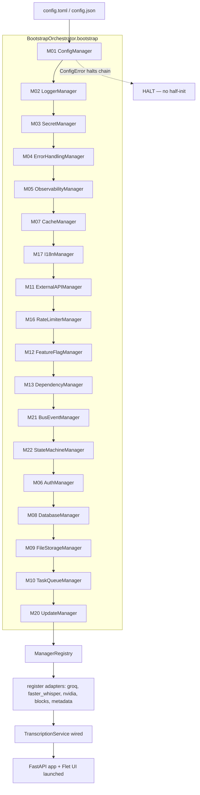

# Design: Audio2Text v2 Core Rearchitecture

> **Change**: `audio2text-v2-core-rearchitecture`
> **Phase**: sdd-design
> **Branch**: `feature/audio2text-v2-core-rearchitecture`
> **Delivery**: Feature Branch Chain with tracker (chained PRs, ≤400 lines each)
> **Package import name**: `cenf_core` (observed in `audio2text/api/dependencies.py:17`)

---

## 1. Technical Approach

The rearchitecture lands core-cenf-py (`cenf_core`) as the sole infrastructure foundation and converts the existing clean `audio2text/` package from direct-import singletons into a **Protocol-dependent, BootstrapOrchestrator-wired** system. The three specs map cleanly: `infrastructure-core` becomes a new `audio2text/infrastructure/` layer that owns all `cenf_core` imports and exposes typed Protocols; `transcription-agents` splits the current monolithic `providers/base.py` ABC into three ports (`TranscriptionProvider`, `MetadataProvider`, `PostProcessingBlock`) with concrete adapters injected by `DependencyManager`; `legacy-elimination` deletes `backend/`, `ui/`, `ui_flet/`, root `main.py` and repoints CI/build to `audio2text/`. Delivery is sliced into chained PRs so no single review exceeds 400 changed lines. The existing `ConfigMigrator` already satisfies most of the XOR→SecretManager spec; it is reused, not rewritten.

---

## 2. Architecture Decisions

| # | Decision | Options | Choice | Rationale |
|---|---|---|---|---|
| D1 | Bootstrap wiring order | (a) alphabetical (b) dependency-ordered (c) lazy on first use | **(b) dependency-ordered** | Spec REQ mandates Config→Logger→Secret→Errors→Observability→rest. Deterministic order makes failure halting predictable and testable. |
| D2 | cenf_core import boundary | (a) import anywhere (b) only in `infrastructure/` (c) only in `api/` | **(b) only in `infrastructure/`** | Golden Rule: business modules depend on Protocols, never adapters. Centralizes the upgrade surface. Current `api/dependencies.py` violates this — it is refactored to consume the registry. |
| D3 | Provider Protocol shape | (a) keep single ABC (b) ABC→`Protocol` + split 3 ports (c) plugin registry | **(b) `Protocol` + 3 ports** | Structural typing enables `isinstance`-free duck typing for tests; splitting ports lets Metadata/PostProcessing vary independently of transcription. |
| D4 | Block injection pattern | (a) hard-coded pipeline stages (b) list injection into service (c) config-driven plugin scan | **(b) list injection** | Spec REQ: caller composes `[TaskExtractor, Summary]`; service iterates in order. Keeps `TranscriptionPipeline` for text transforms, adds `PostProcessingBlock` list for structured blocks. |
| D5 | Config migration strategy | (a) rewrite migrator (b) reuse existing `ConfigMigrator` (c) manual JSON edit | **(b) reuse + harden** | `config/migration.py` already does XOR decode + keyring write + `.v015.bak`. Add idempotent backup guard (spec: no second backup on re-run). |
| D6 | Recording state machine | (a) ad-hoc flags (b) `StateMachineManager` FSM (c) enum + manual guards | **(b) `StateMachineManager` FSM** | Spec REQ: `idle→recording→transcribing→done` + `error`. Determinism, testable transitions, rollback on error. |
| D7 | Event flow | (a) direct method calls (b) `BusEventManager` pub/sub (c) callback registry | **(b) `BusEventManager`** | Spec REQ: `transcription.started/completed/failed`. Decouples UI/overlay/metrics from service. |
| D8 | Dependency resolution | (a) keep `TranscriptionProviderFactory` static registry (b) `DependencyManager` with fallback chain (c) manual if/else ladder | **(b) `DependencyManager`** | Spec REQ: config-driven `fallback_chain`, unknown-type rejection. Replaces the current `get_provider()` if/else ladder in `dependencies.py`. |
| D9 | Chained PR strategy | (a) stacked to main (b) Feature Branch Chain w/ tracker (c) single mega-PR | **(b) Feature Branch Chain** | Whole rearchitecture must integrate before main benefits. Tracker branch = existing `feature/audio2text-v2-core-rearchitecture` (draft PR, no-merge). |
| D10 | LLM calls (AI enhance, blocks) | (a) direct `openai`/`groq` client (b) `ExternalAPIManager` w/ circuit breaker (c) inline httpx | **(b) `ExternalAPIManager`** | Spec REQ: retry, circuit breaker, timeout. Removes direct client construction from services. |
| D11 | Secrets at read time | (a) re-decode XOR each read (b) OS keyring via `SecretManager` (c) env-only | **(b) OS keyring** | Spec REQ: XOR only in one-shot migration decoder, never at read time. |
| D12 | Adapter registration | (a) decorators at import (b) explicit registry in bootstrap (c) entry-points | **(b) explicit registry in bootstrap** | Explicit > magical; keeps wiring visible in one file, matches core-cenf Bootstrap pattern. |

---

## 3. Bootstrap Wiring Diagram



**Halting contract**: any manager constructor failure raises before the next manager starts. The registry is only returned on full success (spec: "no manager instance is left in a half-initialized state").

---

## 4. Adapter + Provider Module Map

```
audio2text/
├── infrastructure/                    ← NEW layer (only place cenf_core is imported)
│   ├── __init__.py                    ← NEW: exports get_registry()
│   ├── bootstrap.py                   ← NEW: BootstrapOrchestrator + 18-manager wiring
│   ├── registry.py                    ← NEW: ManagerRegistry (typed accessors)
│   ├── ports.py                       ← NEW: Protocol typedefs re-exported from cenf_core
│   └── adapters/                      ← NEW: cenf_core adapter wrappers (if signature shaping needed)
│       ├── config_adapter.py
│       ├── logger_adapter.py
│       └── secret_adapter.py
├── providers/
│   ├── ports/                         ← NEW
│   │   ├── __init__.py
│   │   ├── transcription_provider.py  ← Protocol (was base.py ABC)
│   │   ├── metadata_provider.py       ← NEW Protocol
│   │   └── post_processing_provider.py← NEW Protocol (PostProcessingBlock)
│   ├── adapters/                      ← NEW (was flat provider files)
│   │   ├── __init__.py
│   │   ├── groq_adapter.py            ← was groq_provider.py
│   │   ├── faster_whisper_adapter.py  ← was faster_whisper_provider.py
│   │   ├── nvidia_riva_adapter.py     ← was nvidia_riva_provider.py
│   │   ├── task_extractor_adapter.py  ← NEW
│   │   ├── summary_adapter.py         ← NEW
│   │   ├── keyword_extractor_adapter.py ← NEW
│   │   └── jsonl_metadata_adapter.py  ← NEW (default MetadataProvider)
│   ├── mock_provider.py               ← KEEP (test fixture)
│   ├── factory.py                     ← MODIFY: delegate to DependencyManager
│   └── base.py                        ← DELETE (replaced by ports/)
├── services/
│   ├── transcription_service.py       ← MODIFY: inject provider+blocks+metadata+bus+fsm, @handle_errors
│   ├── metadata_service.py            ← MODIFY: delegate to MetadataProvider port
│   └── ... (others: inject managers)
├── config/
│   ├── migration.py                   ← MODIFY: idempotent backup guard
│   ├── _decoder.py                    ← KEEP (XOR decode, one-shot only)
│   ├── _schema.py                     ← KEEP
│   └── schema.py                      ← KEEP
├── api/
│   ├── dependencies.py                ← MODIFY: replace singletons with registry accessors
│   ├── app.py                         ← MODIFY: accept registry in lifespan
│   └── routes/...                     ← MODIFY: read via registry, not direct cenf_core
└── main.py                            ← MODIFY: call BootstrapOrchestrator before app launch
```

**Provider Protocol** (non-obvious pattern — structural typing + runtime `is_available`):

```python
# audio2text/providers/ports/transcription_provider.py
from typing import Protocol, runtime_checkable
from audio2text.domain.transcription import TranscriptionResult

@runtime_checkable
class TranscriptionProvider(Protocol):
    @property
    def provider_name(self) -> str: ...
    @property
    def model_name(self) -> str: ...
    @property
    def is_available(self) -> bool: ...
    def transcribe_file(self, audio_path: str, language: str = "es") -> TranscriptionResult | None: ...
    def transcribe_stream(self, audio_stream: object, language: str = "es") -> TranscriptionResult | None: ...
    def validate_config(self) -> list[str]: ...
```

---

## 5. Chained-PR Slice Plan

**Strategy**: Feature Branch Chain. Tracker = draft PR `feature/audio2text-v2-core-rearchitecture → main` (no-merge). Each child PR targets the previous child's branch. Mark current PR with 📍 in dependency diagrams.

| Slice | PR Title | Scope | Est. Lines | Depends On |
|---|---|---|---|---|
| 1 | `feat(infra): bootstrap skeleton + ConfigManager + LoggerManager` | `infrastructure/bootstrap.py`, `registry.py`, `ports.py`, M01+M02 wiring, unit tests | ~360 | — |
| 2 | `feat(infra): SecretManager + ErrorHandlingManager + XOR migration harden` | M03+M04 adapters, `migration.py` idempotent backup guard, golden test | ~380 | 1 |
| 3 | `feat(infra): Observability + Cache + I18n managers` | M05, M07, M17 adapters; replace `LocalizationManager` usage in services | ~370 | 2 |
| 4 | `feat(providers): split TranscriptionProvider into ports + refactor 3 adapters` | `providers/ports/*`, move groq/faster_whisper/nvidia into `adapters/`, delete `base.py` | ~390 | 3 |
| 5 | `feat(providers): DependencyManager + fallback chain + factory delegation` | M13 wiring, `factory.py` → DependencyManager, unknown-type rejection test | ~340 | 4 |
| 6 | `feat(blocks): PostProcessingBlock port + 3 block adapters + ExternalAPIManager` | `post_processing_provider.py`, task/summary/keyword adapters, M11 for LLM, circuit-breaker test | ~390 | 5 |
| 7 | `feat(metadata): MetadataProvider port + JSONL adapter` | `metadata_provider.py`, `jsonl_metadata_adapter.py`, in-memory test adapter | ~300 | 6 |
| 8 | `feat(events): BusEventManager + StateMachineManager recording FSM` | M21+M22 wiring, `idle→recording→transcribing→done+error`, InvalidTransition tests | ~360 | 7 |
| 9 | `refactor(service): TranscriptionService inject all managers + @handle_errors` | Rewrite `transcription_service.py`, `api/dependencies.py` → registry, integration tests | ~400 | 8 |
| 10 | `feat(infra): remaining managers (Auth, DB, FileStorage, TaskQueue, FeatureFlag, RateLimiter, Update)` | M06/M08/M09/M10/M12/M16/M20 wiring into registry, smoke tests | ~380 | 9 |
| 11 | `chore(legacy): delete backend/ directory` | Remove `backend/`, fix any straggler imports, green suite | ~350 | 10 |
| 12 | `chore(legacy): delete ui/, ui_flet/, root main.py, verification_test.py` | Remove legacy UI + entry points, green suite | ~390 | 11 |
| 13 | `chore(build): CI/CD + pyproject + setup.py + scripts target audio2text/` | `.github/workflows/ci.yml`, `pyproject.toml`, `setup.py`, `scripts/build.py` | ~360 | 12 |

**Tracker dependency diagram** (appears in every child PR body):

```
main
 └── feature/audio2text-v2-core-rearchitecture   (tracker, draft, no-merge)
      ├── slice-1-bootstrap-config-logger        📍 when active
      ├── slice-2-secret-errors                  (targets slice-1 branch)
      ├── ...
      └── slice-13-build-scripts                  (targets slice-12 branch)
```

**Per-slice verification gate**: `pytest tests/` green + `rg "from (backend|ui|ui_flet)\." audio2text/` clean (from slice 11 onward). Each slice independently `git revert`-able.

---

## 6. File Changes

| Action | Path | Description |
|---|---|---|
| **CREATE** | `audio2text/infrastructure/__init__.py` | Package init, exports `get_registry()` |
| **CREATE** | `audio2text/infrastructure/bootstrap.py` | `BootstrapOrchestrator` — wires 18 managers in dependency order |
| **CREATE** | `audio2text/infrastructure/registry.py` | `ManagerRegistry` — typed accessors for each manager |
| **CREATE** | `audio2text/infrastructure/ports.py` | Re-exported Protocol typedefs from cenf_core |
| **CREATE** | `audio2text/infrastructure/adapters/config_adapter.py` | Wraps `cenf_core.ConfigManager` (schema shaping if needed) |
| **CREATE** | `audio2text/infrastructure/adapters/logger_adapter.py` | Wraps `cenf_core.LoggerManager` |
| **CREATE** | `audio2text/infrastructure/adapters/secret_adapter.py` | Wraps `cenf_core.SecretManager` (keyring) |
| **CREATE** | `audio2text/providers/ports/__init__.py` | Ports package |
| **CREATE** | `audio2text/providers/ports/transcription_provider.py` | `TranscriptionProvider` Protocol |
| **CREATE** | `audio2text/providers/ports/metadata_provider.py` | `MetadataProvider` Protocol |
| **CREATE** | `audio2text/providers/ports/post_processing_provider.py` | `PostProcessingBlock` Protocol |
| **CREATE** | `audio2text/providers/adapters/__init__.py` | Adapters package |
| **CREATE** | `audio2text/providers/adapters/groq_adapter.py` | Groq adapter (moved from `groq_provider.py`) |
| **CREATE** | `audio2text/providers/adapters/faster_whisper_adapter.py` | faster-whisper adapter (moved) |
| **CREATE** | `audio2text/providers/adapters/nvidia_riva_adapter.py` | NVIDIA Riva adapter (moved) |
| **CREATE** | `audio2text/providers/adapters/task_extractor_adapter.py` | TaskExtractor `PostProcessingBlock` adapter |
| **CREATE** | `audio2text/providers/adapters/summary_adapter.py` | Summary adapter |
| **CREATE** | `audio2text/providers/adapters/keyword_extractor_adapter.py` | KeywordExtractor adapter |
| **CREATE** | `audio2text/providers/adapters/jsonl_metadata_adapter.py` | Default JSONL `MetadataProvider` |
| **MODIFY** | `audio2text/services/transcription_service.py` | Inject provider + blocks list + metadata + bus + fsm; `@handle_errors`; emit events |
| **MODIFY** | `audio2text/services/metadata_service.py` | Delegate persistence to `MetadataProvider` port |
| **MODIFY** | `audio2text/config/migration.py` | Add idempotent backup guard (skip 2nd backup if `.v015.bak` exists) |
| **MODIFY** | `audio2text/providers/factory.py` | Delegate to `DependencyManager`; keep as thin facade for backward-compat |
| **MODIFY** | `audio2text/api/dependencies.py` | Replace singleton cache + direct `cenf_core` imports with `registry.get_*()` |
| **MODIFY** | `audio2text/api/app.py` | Accept `ManagerRegistry` in lifespan; remove direct manager construction |
| **MODIFY** | `audio2text/api/routes/*.py` | Read config/secrets via registry accessors |
| **MODIFY** | `audio2text/main.py` | Call `BootstrapOrchestrator().bootstrap()` before app launch |
| **MODIFY** | `.github/workflows/ci.yml` | Target `audio2text/` + `tests/`; remove `backend/` path triggers; bump Python to 3.12 |
| **MODIFY** | `pyproject.toml` | `include = ["audio2text*"]`; add `cenf_core` dep; remove legacy entry points |
| **MODIFY** | `setup.py` | Sole package `audio2text`; entry `audio2text.main:main` |
| **MODIFY** | `scripts/build.py` | PyInstaller targets `audio2text/` |
| **DELETE** | `audio2text/providers/base.py` | Replaced by `ports/transcription_provider.py` |
| **DELETE** | `audio2text/providers/groq_provider.py` | Moved to `adapters/groq_adapter.py` |
| **DELETE** | `audio2text/providers/faster_whisper_provider.py` | Moved to adapters |
| **DELETE** | `audio2text/providers/nvidia_riva_provider.py` | Moved to adapters |
| **DELETE** | `backend/` | Entire legacy backend (git history preserved) |
| **DELETE** | `ui/` | Entire legacy CustomTkinter UI |
| **DELETE** | `ui_flet/` | Entire abandoned Flet UI |
| **DELETE** | `main.py` (root) | Legacy entry point (replaced by `audio2text/main.py`) |
| **DELETE** | `verification_test.py` | Legacy verification script |
| **KEEP** | `audio2text/providers/mock_provider.py` | Test fixture, implements Protocol |
| **KEEP** | `audio2text/config/_decoder.py` | XOR decode (one-shot migration only) |
| **KEEP** | `audio2text/config/_schema.py`, `schema.py` | Pydantic schema + defaults |

---

## 7. Testing Strategy

| Layer | What | How | Target |
|---|---|---|---|
| **Unit** | Each Protocol contract: provider `is_available`, block `process`, FSM transitions, `DependencyManager` resolve/reject, `ConfigMigrator` idempotency | `pytest` + `pytest-mock`; `MockProvider`/in-memory adapters; `ParamSpec`-free fakes | 80% of new code |
| **Unit** | Bootstrap halting: missing config → `ConfigError` before manager #2 | Fixture: temp dir, no config.toml; assert only ConfigManager attempted | 1 test per manager boundary |
| **Integration** | `TranscriptionService` end-to-end with MockProvider + 2 injected blocks + in-memory MetadataProvider + captured BusEvents | Compose service from fakes; assert event sequence + result text | Full happy + error path |
| **Integration** | XOR→SecretManager migration round-trip on a golden `config.json` fixture | `ConfigMigrator(secret_manager=fake_keyring).run()`; assert keyring has `gsk_` key, new config has none, `.v015.bak` exists, 2nd run creates no new backup | Spec scenario 1:1 |
| **Integration** | Circuit breaker on LLM: 5 failures → `CircuitOpenError` → fallback text | Mock `ExternalAPIManager` raising; assert block returns fallback | Spec REQ |
| **E2E** | API health + transcription endpoint via TestClient against bootstrapped app | `fastapi.testclient.TestClient`; POST `/api/v1/transcribe` with mock audio | Smoke per slice |
| **Regression** | No legacy imports leak | `rg "from (backend\|ui\|ui_flet)\." audio2text/` in CI (from slice 11) | 0 matches |
| **Coverage** | Overall | `pytest --cov=audio2text --cov-fail-under=50` | ≥50% after final slice |

**Per-slice rule**: every slice ships its own tests in the same PR (work-unit-commits). RED-GREEN per slice where the contract is observable.

---

## 8. Data Flow

```
┌─────────────┐     ┌──────────────────┐     ┌──────────────────────┐
│ Hotkey / UI │────▶│ StateMachine FSM │────▶│ AudioCaptureService  │
│  (F8 toggle)│     │ idle→recording   │     │ (sounddevice → WAV)  │
└─────────────┘     └────────┬─────────┘     └──────────┬───────────┘
                             │ event: start              │ audio_path
                             ▼                            ▼
                    ┌──────────────────┐     ┌──────────────────────┐
                    │  BusEventManager │◀────│ DependencyManager    │
                    │  .publish(       │     │ resolve(primary or   │
                    │   started)       │     │  fallback_chain)     │
                    └────────┬─────────┘     └──────────┬───────────┘
                             │                          │
                             │ subscribers              │ TranscriptionProvider
                             │ (overlay, metrics)       ▼
                             │             ┌──────────────────────┐
                             │             │ TranscriptionService │── @handle_errors
                             │             │  .transcribe(path)   │── ObservabilityManager span
                             │             └──────────┬───────────┘
                             │                        │ raw text
                             │                        ▼
                             │             ┌──────────────────────┐
                             │             │ PostProcessingBlock[]│ (injected list)
                             │             │ TaskExtractor→Summary│── ExternalAPIManager (LLM)
                             │             │ →KeywordExtractor    │   (circuit breaker)
                             │             └──────────┬───────────┘
                             │                        │ processed text
                             │                        ▼
                             │             ┌──────────────────────┐
                             │             │ MetadataProvider     │── JSONL / injectable
                             │             │  .save(result)       │
                             │             └──────────┬───────────┘
                             ▼                        │
                    ┌──────────────────┐              ▼
                    │  BusEventManager │     ┌──────────────────────┐
                    │  .publish(       │────▶│ FSM: transcribing    │
                    │   completed,     │     │   → done             │
                    │   result)        │     └──────────────────────┘
                    └──────────────────┘
```

**Cache shortcut**: before provider call, `CacheManager.get(sha256(audio_path))` → hit returns cached `TranscriptionResult`, increments `cache_hits_total`, skips provider + blocks.

---

## 9. Open Questions

| # | Question | Impact | Default if unresolved |
|---|---|---|---|
| Q1 | Exact `cenf_core` manager constructor signatures (e.g., does `ErrorHandlingManager` expose `@handle_errors` as decorator factory or instance method?) | Slice 2, 9 wiring | Verify against installed `cenf_core` (`pip show cenf-core`) + `AGENTS_API.md` before slice 2 apply. Fallback: thin adapter shapes the API. |
| Q2 | Does `cenf_core.StateMachineManager` accept a declarative transition table, or does each FSM need subclassing? | Slice 8 FSM design | Assume declarative table (dict-based); verify before apply. |
| Q3 | OS keyring availability on headless CI runners (no keychain daemon) — does `SecretManager` fall back to env/file? | Integration test for migration | Use injectable fake keyring in tests; real keyring only in slice 10 smoke. |
| Q4 | Should `TranscriptionProviderFactory` stay as a thin facade over `DependencyManager` (backward compat) or be deleted entirely? | Slice 5 | Keep as facade for one release; mark deprecated. |
| Q5 | Whether slice 11+12 (legacy deletion) can merge to main directly or must wait for the full chain (tracker strategy). | Merge order | Feature Branch Chain: all children merge into tracker, tracker merges to main last. |

---

## Design Guard Lines

- **Decision needed before apply**: Yes (Q1–Q3 verify against installed `cenf_core`)
- **Chained PRs recommended**: Yes (13 slices, Feature Branch Chain)
- **400-line budget risk**: Medium (slices 4, 6, 9 near ceiling — split if apply exceeds)
